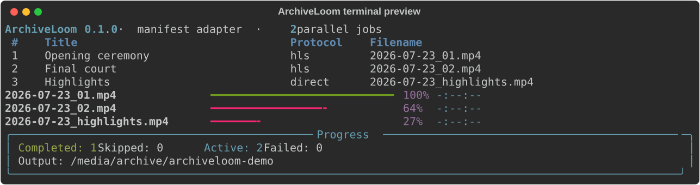

<p align="center">
  
</p>

<p align="center"><strong>Weave web media into reliable local archives.</strong></p>

<p align="center">
  <a href="docs/README.ja.md">日本語</a> ·
  <a href="https://nematatu.github.io/archiveloom/">Documentation</a> ·
  <a href="docs/installation.md">Installation</a> ·
  <a href="docs/usage.md">Usage</a> ·
  <a href="docs/AGENT_PROMPT.md">AI adapter prompt</a> ·
  <a href="docs/adapters.md">Build an adapter</a> ·
  <a href="CONTRIBUTING.md">Contributing</a>
</p>

<p align="center">
  <a href="https://github.com/nematatu/archiveloom/actions/workflows/ci.yml"></a>
  <a href="https://github.com/nematatu/archiveloom/releases"></a>
  
  
  <a href="LICENSE"></a>
  
</p>

> [!IMPORTANT]
> ArchiveLoom is in alpha. Its safety model and plugin API are usable, but the first stable release and signed standalone binaries are still on the roadmap.

## What ArchiveLoom is — and is not

**ArchiveLoom is the reusable bulk-download core generalized from an InHigh TV-specific downloader and released as cross-platform open-source software.**

It turns the difficult, reusable parts—collection selection, parallel downloads, restart handling, fixed progress, external-drive safeguards, FFmpeg execution, and output verification—into one shared application. Knowledge of a particular site's pages and player remains in a small adapter.

### The experience we are building toward

Our goal is simple: **give ArchiveLoom a supported video-site page URL, review the discovered videos, and download the ones you select.**

The web makes that harder than it sounds. Every site exposes dates, categories, pagination, player metadata, and stream URLs differently. ArchiveLoom therefore combines a stable download core with installable site adapters instead of pretending that one scraper can safely understand every site forever.

| What you give ArchiveLoom | Does it work out of the box? |
|---|---|
| A direct media, HLS (`.m3u8`), or DASH (`.mpd`) URL | **Yes** |
| An ArchiveLoom JSON collection containing known media URLs | **Yes** |
| An ordinary webpage containing an unknown player or media catalog | **Only with a compatible site adapter** |
| DRM-protected media or access-control bypass | **No, and this is intentionally unsupported** |

If a site adapter does not exist, a developer—or an AI coding agent following the [engineering blueprint](docs/engineering-blueprint.ja.md)—must first inspect that site's authorized public interface and implement its discovery logic. Installing ArchiveLoom alone does not make arbitrary webpage URLs downloadable.

ArchiveLoom is a cross-platform CLI/TUI for archiving **collections** of media you own or are authorized to download. It separates a dependable download engine from small, reviewable site adapters, so one site changing does not destabilize the rest of the application.

It is designed for the awkward jobs that a browser download button does not solve: dozens of long recordings, multiple dates or categories, resumable overnight runs, external-drive-only storage, clear progress, and deterministic verification.

## The intended AI-assisted workflow

For a site that ArchiveLoom does not know yet, you do not need to redesign the downloader. Give this repository and the target URL to an AI coding agent:

```text
Open the ArchiveLoom repository and read docs/AGENT_PROMPT.md completely.

Target site URL: https://example.com/archive
I am authorized to download: <describe the allowed content>
I want to select by: <date, category, stage, camera, or another grouping>
Filename format: <desired format>
Allowed work: implement and test the adapter; do not start the full download

Follow the prompt's investigation, safety, testing, and handoff requirements.
```

The expected workflow is:

1. The AI reads [`docs/AGENT_PROMPT.md`](docs/AGENT_PROMPT.md) and the linked engineering contract.
2. It inspects the actual site instead of guessing its structure.
3. It implements and tests a narrowly scoped site adapter.
4. It gives you the exact install, `inspect`, `--check-only`, and download commands.
5. You review the discovered list and start the download yourself.

This is the current bridge between “unknown webpage URL” and the one-command experience. An AI agent cannot guarantee that every site is supportable: DRM, prohibited access, unstable authentication, or an unavailable public interface must result in a clear stop, not a workaround.

## What you can use today

### 1. Download one known media URL

If you already have the actual media URL—not merely the webpage that contains a player—ArchiveLoom can inspect and download it directly:

```console
archiveloom download "https://example.com/video/master.m3u8" \
  --output "/path/to/external-drive/archive" \
  --check-only

archiveloom download "https://example.com/video/master.m3u8" \
  --output "/path/to/external-drive/archive"
```

### 2. Select and download several known media URLs

Put the items in an ArchiveLoom collection file such as [`examples/collection.json`](examples/collection.json), then open the interactive selector:

```console
archiveloom download collection.json \
  --output "/path/to/external-drive/archive" \
  --interactive \
  --jobs 2
```

```text
ArchiveLoom

[x] 2026-07-23 · Stage 01
[x] 2026-07-23 · Stage 02
[ ] 2026-07-24 · Stage 01
[x] 2026-07-24 · Stage 02

j/k or ↑/↓  Move     Space  Toggle     a  Select all
Enter        Continue q      Quit
```

### 3. Support a normal website page

A normal page such as `https://example.com/event` requires a site adapter that understands that site's dates, categories, pagination, player data, and media identifiers. Generate a plugin skeleton with:

```console
archiveloom adapters scaffold example_site --output ./plugins
```

You can give the site URL and the [site-adapter agent prompt](docs/AGENT_PROMPT.md) to a developer or AI coding agent and ask it to implement and test that adapter. Once installed, the adapter turns the site's page structure into the same normalized collection used by the download engine.

### What about InHigh TV?

ArchiveLoom grew out of lessons learned while building a separate InHigh TV-specific downloader, but that downloader is **not bundled** with ArchiveLoom. Version 0.1.0 does not include an InHigh TV adapter, so passing an InHigh TV webpage URL to ArchiveLoom does not currently discover its archive videos. A separately developed and installed adapter would be required.

<p align="center">
  
</p>

## Why ArchiveLoom?

- **Collections first** — discover, review, filter, and archive many items as one run.
- **Adapter driven** — site knowledge lives in plugins, not in the core engine.
- **Safe by default** — no silent overwrite, no internal-disk fallback, no DRM bypass.
- **Restart-friendly** — verified files are skipped; direct downloads attempt HTTP Range resume.
- **Observable** — fixed terminal progress, per-item status, bounded retries, and explicit exit codes.
- **Verified output** — files become final only after `ffprobe` can read their media streams.
- **Cross-platform** — macOS, Windows, and Linux are tested in CI.
- **Multilingual foundation** — English and Japanese core prompts plus maintained documentation.
- **Extensible** — create an installable adapter package with one command.

## Quick start

### 1. Install FFmpeg

ArchiveLoom uses `ffmpeg` and `ffprobe` for HLS/DASH and final verification. See the [OS-specific installation guide](docs/installation.md).

### 2. Install ArchiveLoom from GitHub

With [`pipx`](https://pipx.pypa.io/):

```console
pipx install git+https://github.com/nematatu/archiveloom.git
```

With [`uv`](https://docs.astral.sh/uv/):

```console
uv tool install git+https://github.com/nematatu/archiveloom.git
```

### 3. Check the machine

```console
archiveloom doctor --output /path/to/archive
```

Require a physically external target when ArchiveLoom can verify it:

```console
archiveloom doctor --output /path/to/archive --external-only
```

### 4. Inspect before writing

```console
archiveloom inspect "https://cdn.example.org/event/master.m3u8"
archiveloom download "https://cdn.example.org/event/master.m3u8" \
  --output /path/to/archive \
  --check-only
```

### 5. Archive

```console
archiveloom download "https://cdn.example.org/event/master.m3u8" \
  --output /path/to/archive
```

For a collection manifest with keyboard selection:

```console
archiveloom download collection.json \
  --output /path/to/archive \
  --interactive \
  --jobs 2
```

Use `↑/↓` or `j/k` to move, `Space` to toggle, `a` to select all, and `Enter` to continue.

## Collection manifests

ArchiveLoom includes a portable JSON adapter for teams that already know the media URLs:

```json
{
  "version": 1,
  "items": [
    {
      "id": "day-1-stage-a",
      "title": "Day 1 · Stage A",
      "url": "https://cdn.example.org/day-1/stage-a/master.m3u8",
      "protocol": "hls",
      "filename": "2026-07-23_stage-a.mp4",
      "dimensions": {"date": "2026-07-23", "stage": "A"}
    }
  ]
}
```

See [examples/collection.json](examples/collection.json) and the [manifest reference](docs/usage.md#collection-manifest).

## Site adapters

Adapters discover normalized media items. They can represent sports courts, conference stages, lectures, cameras, playlists, or any other site-specific hierarchy without adding those assumptions to the core.

```console
archiveloom adapters list
archiveloom adapters scaffold my_site --output ./plugins
```

Third-party adapters are normal Python packages registered through the `archiveloom.adapters` entry-point group. Read [Building an adapter](docs/adapters.md) before opening a pull request.

## Platform support

| Capability | macOS | Windows | Linux |
|---|:---:|:---:|:---:|
| Python package | ✅ | ✅ | ✅ |
| Direct HTTP(S) media | ✅ | ✅ | ✅ |
| HLS/DASH through FFmpeg | ✅ | ✅ | ✅ |
| Interactive selector | ✅ | ✅ | ✅ |
| External-disk verification | `diskutil` | PowerShell | `findmnt` + `lsblk` |
| CI tests | ✅ | ✅ | ✅ |
| Standalone signed binary | Planned | Planned | Planned |

External-disk detection is intentionally conservative. `--external-only` fails closed when ArchiveLoom cannot prove the selected target is external. Windows and Linux behavior is covered by mocked platform tests locally, and the [first hosted matrix run](https://github.com/nematatu/archiveloom/actions/runs/30329505144) passed on all three operating systems.

## Project layout

```text
archiveloom/
├── src/archiveloom/       Core engine, TUI, adapters, platform checks
├── tests/                 Unit and integration tests
├── docs/                  English and Japanese documentation
├── examples/              Safe example manifests and plugin samples
├── assets/                Brand assets and terminal screenshots
├── scripts/               Maintainer and release utilities
└── .github/               CI, releases, issue forms, PR template
```

## Responsible use

ArchiveLoom is for content you own, public-domain content, or content you are authorized to download. It does not bypass DRM, paywalls, authentication, or access controls. Site terms and local law still apply. See [Responsible use](docs/responsible-use.md).

## Documentation

- [Installation](docs/installation.md)
- [Usage and exit codes](docs/usage.md)
- [Architecture](docs/architecture.md)
- [AI site-adapter prompt](docs/AGENT_PROMPT.md)
- [AI・実装者向け設計ブループリント（日本語）](docs/engineering-blueprint.ja.md)
- [Adapter development](docs/adapters.md)
- [Responsible use](docs/responsible-use.md)
- [Security policy](SECURITY.md)
- [Roadmap](ROADMAP.md)

## Community

Bug reports, adapter proposals, documentation improvements, translations, and platform testing are welcome. Please read [CONTRIBUTING.md](CONTRIBUTING.md) and the [Code of Conduct](CODE_OF_CONDUCT.md) first.

## License

ArchiveLoom is available under the [MIT License](LICENSE). Site adapters and bundled release dependencies may have their own licenses; contributors must document them.
