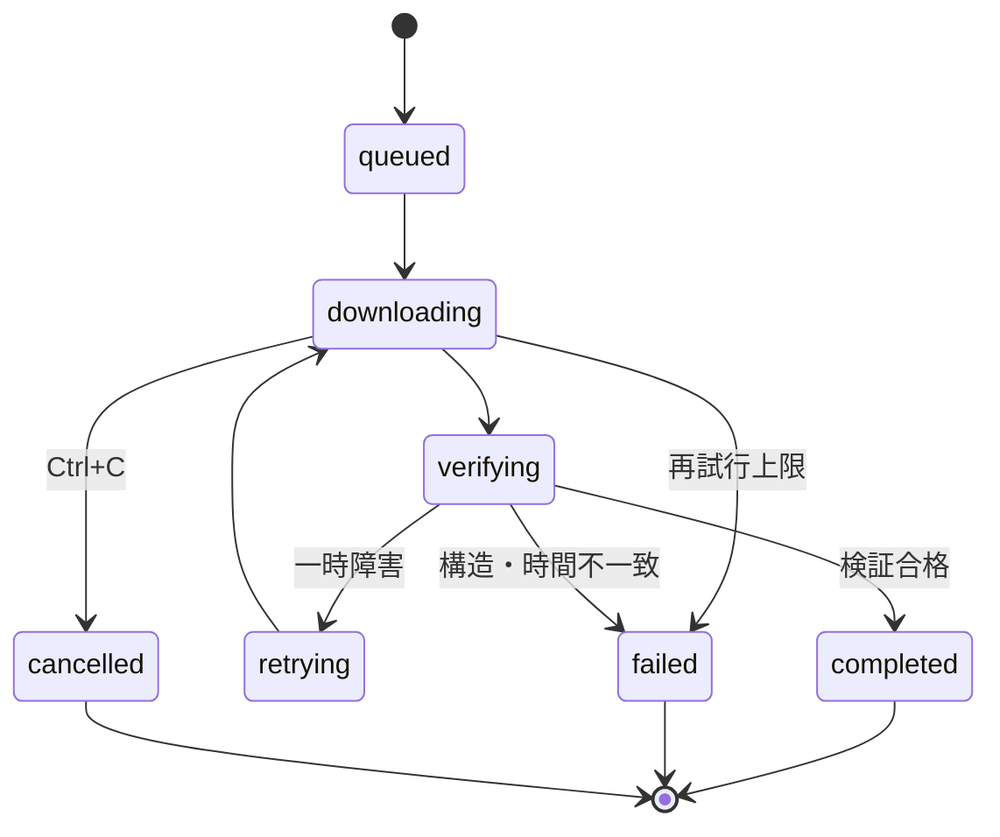

# 大量メディア保存CLI 設計ブループリント

この文書は、未知のWebサイトへArchiveLoomアダプターを実装する人間またはAIが、調査からテスト、配布までを一貫して行うための実装契約です。特定サイトのURL、DOM、ID、日付、競技、会場名を別サイトへ流用してはいけません。

## 1. 最初に固定する原則

1. 対象サイトの構造を推測せず、公開ページ、HTML、埋め込みJSON、ネットワーク通信、公開APIを実際に確認する。
2. 取得対象は、ユーザーが所有または保存を許可されているメディアに限定する。
3. DRM、課金、認証、アクセス制御、CAPTCHAを回避しない。検出時は理由を示して停止する。
4. サイト固有処理はアダプター、保存・検証・並列処理はコアへ置く。
5. 大量実行前に必ず読み取り中心の事前確認を行う。
6. 完了済みを再取得せず、中断後に安全に再実行できるようにする。
7. 一件の失敗でキュー全体を永久停止させない。
8. 一時ファイル、状態、ロックは選択した保存先の配下だけに置く。
9. 未確認の件数、品質、URL有効期限、完了時刻を断定しない。
10. 実装、代表試験、全件実行を別の権限段階として扱う。

## 2. 実装前の入力契約

| 分類 | 確定する内容 | 確定方法 |
|---|---|---|
| 起点 | 一覧ページ、チャンネル、コレクションURL | ユーザー指定 |
| 範囲 | 日付、カテゴリ、会場、ページ、ID | ユーザー要求＋サイト調査 |
| 権利 | 保存が許可されているか | ユーザー確認＋公開条件 |
| 認証 | ログイン、Cookie、短期トークンの要否 | サイト調査 |
| 品質 | 最高品質、上限、音声・字幕 | ユーザー指定 |
| 保存先 | 任意または外付け限定 | ユーザー指定＋OS診断 |
| 命名 | ファイル名と階層 | ユーザー指定 |
| 選択 | 全件、フィルター、複数選択 | ユーザー指定 |
| 並列度 | 初期値、最大値、配信元制約 | 保守的既定値＋実測 |
| 完了条件 | 構造、時間、サイズ、件数 | アダプター契約＋ffprobe |

読み取り調査で分からない事項のうち、権利、保存先、認証経路、再エンコード、既存ファイルの扱いが結果を変える場合は、推測せず確認します。

## 3. サイト調査の順序

軽量で安定した手段から順に調べます。

1. 公開されたAPIまたは配信フィード
2. ページ内の構造化データ、JSON-LD、埋め込み状態
3. HTMLの安定した属性とリンク
4. ブラウザーのネットワーク通信
5. 必要な場合だけブラウザー自動操作

調査結果には取得時刻を添え、次を記録します。

- 分類軸と値
- ページネーション方式と終了条件
- 安定IDの候補
- 再生ページからメディアURLまでの解決経路
- HLS、DASH、直接ファイルの別
- 署名URLの有効期限と再解決方法
- 必須ヘッダー
- DRMや非対応構成の判定材料
- 空一覧、削除済み、地域制限、レート制限時の応答

画面上のボタン名やCSSクラスだけへ依存せず、可能なら意味のあるIDや構造化データを使います。ブラウザー操作が必要でも、動画本体の取得はHTTPクライアントまたはFFmpegへ分離します。

## 4. アダプター契約

アダプターの役割は、サイト情報を`MediaItem`へ正規化するところまでです。

```python
class SiteAdapter:
    name = "example_site"
    description = "Example Site public archives"

    def can_handle(self, source: str) -> bool: ...

    def discover(self, source: str) -> list[MediaItem]: ...
```

各項目は次を満たします。

- `stable_id`: 期限付き署名を含まない、再実行時も同じ識別子
- `title`: 人間が選択画面で理解できる表示名
- `media_url`: HTTP(S)の実メディアまたはマニフェスト
- `protocol`: `direct`、`hls`、`dash`のいずれか
- `filename`: OS間で安全かつ決定的な名前
- `source_url`: 項目を発見した公開ページまたはマニフェスト
- `duration_seconds`: 分かる場合だけ設定する期待再生時間
- `headers`: 改行を含まない必要最小限のHTTPヘッダー
- `dimensions`: 日付、会場、講義、カメラなど、サイト固有の分類軸

日付、コート、講義番号などをコアへ固定実装しません。スポーツ大会なら`date`と`court`、カンファレンスなら`day`と`track`をアダプターが渡します。

## 5. 発見処理

発見処理は必ず有限にします。

- ページ数またはカーソル数に上限を設ける。
- 同じカーソルの再出現を検出する。
- 安定IDで重複を除外する。
- 接続、読み取り、全体処理にタイムアウトを設ける。
- 429と`Retry-After`を尊重する。
- 空一覧を成功扱いにせず、ユーザーが範囲を誤った可能性を示す。
- DOMやJSON契約の変化を「0件」と誤認せず、構造変更として報告する。

発見だけを確認できる`inspect`と、書き込みを伴わない`download --check-only`を先に成功させます。

## 6. 保存先とファイル安全性

保存開始前に、絶対パス、書き込み権限、空き容量、ファイルシステム、外付け判定を確認します。

- `--external-only`では、外付けと証明できない保存先を拒否する。
- 判定不能を外付け扱いにしない。
- 内蔵ストレージへ部分ファイルやログを退避しない。
- 出力ルート以下の`.archiveloom/`だけを状態領域とする。
- メタデータディレクトリのシンボリックリンクを拒否する。
- サイト由来IDをそのまま内部ファイル名にせず、ハッシュ化する。
- 最終ファイルが既に存在し検証に失敗した場合、自動上書きしない。
- 最終確定は同じファイルシステム上の原子的置換で行う。

外付け判定はOSごとに異なります。

| OS | 判定手段 | 安全側の失敗条件 |
|---|---|---|
| macOS | `diskutil info -plist` | `Internal`を取得できない |
| Windows | PowerShell `Get-Partition`→`Get-Disk` | ドライブ文字、BusType、System/Bootを確認できない |
| Linux | `findmnt`＋`lsblk` | ブロックデバイスまたはtransportを確認できない |

## 7. ダウンロード状態機械



`completed`は「プロセスが終了した」ではなく、最終ファイルが検証に合格した状態です。状態ファイルは一時ファイルへ書き、`fsync`後に置換します。同じ保存先には実行ロックを取得し、二重起動を拒否します。

## 8. プロトコル別処理

### 直接HTTP(S)

- ストリームで読み、メモリーへ全体を載せない。
- 部分ファイルがあればRange再開を試みる。
- サーバーが206を返さなければ先頭から再開する。
- ETagまたはLast-Modifiedが永続化されるまでは、再開を完全保証と表現しない。
- 書き込み終了時にflushと`fsync`を行う。

### HLS/DASH

- FFmpegへ引数配列を渡し、シェル展開を使わない。
- 原則`-c copy`で元配信を再エンコードしない。
- 必要なプロトコルだけを許可する。
- `-progress pipe:1`の機械可読出力から進捗を得る。
- 一定時間進捗がなければ停止、再試行、次項目への継続を行う。
- DRM、未対応暗号化、複雑なmulti-periodなどは理由付き非対応にする。

## 9. 並列度

既定は2程度から開始します。並列度を上げれば必ず速くなるとは限りません。

- 配信元のレート制限
- 回線帯域
- USBバスとHDDのランダム書き込み
- FFmpegの接続数
- 署名URLの期限

これらを同時に考慮します。CPU負荷よりネットワークまたはディスクI/Oが律速することもあります。自動調整を実装する場合でも、上限を設け、ユーザー設定を越えません。

## 10. 進捗表示

対話モードは固定領域を再描画し、同じ状態を標準出力へ追記し続けません。

表示対象:

- 項目ごとの状態、進捗率、処理済み時間またはバイト
- 実測速度
- 項目ごとの残り時間
- 完了、失敗、待機の件数
- 全体進捗と推定終了時刻

推定値は初期サンプルが少ない間は「計算中」とし、極端な変動を平滑化します。完了直前のFFmpeg flushやコンテナ確定では、99.9%のままI/O待ちになる可能性があるため、ストール監視とプロセス状態を別に扱います。

非TTYではANSI再描画を行わず、CIやログ収集向けの簡潔なイベント出力へ切り替える設計が望まれます。

## 11. 中断と子プロセス

Ctrl+Cは次の順に扱います。

1. 新規ジョブ投入を停止する。
2. 共有キャンセルフラグを設定する。
3. 実行中のHTTPループを終了する。
4. FFmpegへ終了要求を送る。
5. 有限時間だけ待ち、必要ならkillする。
6. 結果と部分ファイルを保存先へ残す。
7. 実行ロックを解放する。

スレッドプールの終了待ちで無期限に止まらないことを疑似障害テストで確認します。HDDやカーネルI/Oが応答しない場合、ユーザーへ安全な取り外し前の注意を表示し、即時抜去を促しません。

## 12. 検証

最低限、`ffprobe`で音声または映像ストリームを確認します。期待時間が分かる場合は、固定値と割合の大きい方を許容差に使います。

追加できる検証:

- ファイルサイズの下限
- 期待コーデック
- 解像度
- セグメント数または連続性
- SHA-256チェックサム

検証に失敗した最終ファイルは、正常完了としてスキップしません。同時に、ユーザーの既存ファイルを黙って置換しません。

## 13. 秘密情報

- Cookie、Bearer token、署名クエリをGit、状態、ログ、Issueへ保存しない。
- URLをエラーへ出す場合はuserinfo、query、fragmentを除去する。
- FFmpeg stderrにもURLが含まれ得るため、表示前に再度マスクする。
- 認証が必要な場合は、OSキーチェーンや短期環境変数など正式な経路を設計する。
- 第三者アダプターはユーザー権限で動くPythonコードであり、サンドボックスではないと明示する。

## 14. テスト行列

### ユニットテスト

- URL照合、安定ID、重複除外、ファイル名
- 正常、空、壊れたJSON、サイト構造変更
- ヘッダー改行、パストラバーサル、シンボリックリンク
- 保存先書き込み不可、内蔵、判定不能、外付け
- ロック競合、破損状態、原子的書き込み
- 200、206、Range無視、再試行、タイムアウト
- ffprobe成功、空ファイル、壊れた出力、時間不一致
- URL秘密情報のマスク
- `j/k`、Space、全選択、Enter、キャンセル

### CI

- macOS、Windows、Linux
- 対応する最古と最新のPython
- Ruff、Mypy、pytest、カバレッジ
- Wheel/sdist作成とメタデータ検証
- ドキュメントのstrict build
- GitHub Actions構文検査
- CodeQL

### 実サイト試験

ユーザーが許可した場合だけ、代表1件を短時間または全体取得せず検査します。件数、品質、時間、URL有効性は調査時刻付きスナップショットとして報告します。

## 15. 完了ゲート

次を満たすまで「完成」と表現しません。

- `inspect`と`--check-only`が実データ構造を正しく示す。
- 対象と除外理由が明確である。
- 保存先ポリシーに違反しない。
- 完了済み正常ファイルを再取得しない。
- 進捗表示が標準出力を増殖させない。
- ストール、再試行、中断が有限時間で処理される。
- 最終ファイルが検証される。
- 同じ保存先の二重起動が拒否される。
- 秘密値がログとGitへ残らない。
- 対応OSのCIとパッケージ作成が成功する。
- README、インストール、使い方、ライセンス、貢献手順が実装と一致する。

## 16. AIへ渡す実装依頼テンプレート

利用者向けの完成した入口は[AIサイトアダプター実装プロンプト](AGENT_PROMPT.ja.md)です。AIにはそのファイルを最初から最後まで読ませ、対象URLと利用者固有の条件を渡してください。本節は、その中で使われる最小テンプレートです。

```text
ArchiveLoomへ対象サイト専用アダプターを実装してください。

起点URL:
対象範囲:
保存が許可されている根拠:
認証の要否:
希望品質:
保存先ポリシー:
命名規則:
選択方法:
実行してよい段階: 実装のみ / 代表試験まで / 選択全件完了まで

この設計ブループリントを守り、まずサイトを実測調査してください。
既存アダプターのDOM、ID、URLを推測で流用しないでください。
実装後は、静的解析、単体テスト、書き込みなし検査、代表試験の順に検証し、
検証済み事項と未検証事項を分けて報告してください。
```

## 17. 大会アーカイブを扱う場合の例

複数日・複数会場の大会サイトは、ArchiveLoomが対象とする構造の一例です。

- アダプターが公開アーカイブ一覧から日付、会場、コート、再生ページを発見する。
- 各再生ページから、その時点で有効なHLS/DASH URLを解決する。
- `dimensions`へ日付とコートを入れる。
- `filename`を`YYYY-MM-DD_コート.mp4`のように決定する。
- コアは競技名やコート数を知らず、選択、保存、検証だけを担当する。

この例のDOM、API、配信事業者、ID形式はサイトごと・年度ごとに異なります。前年や別競技の値を固定しないことが、長期保守で最も重要です。
